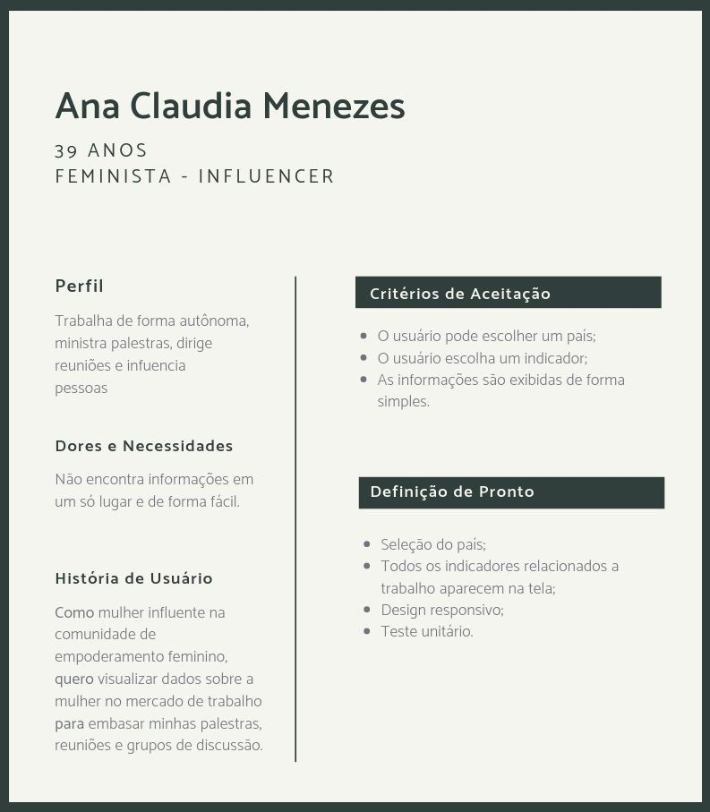
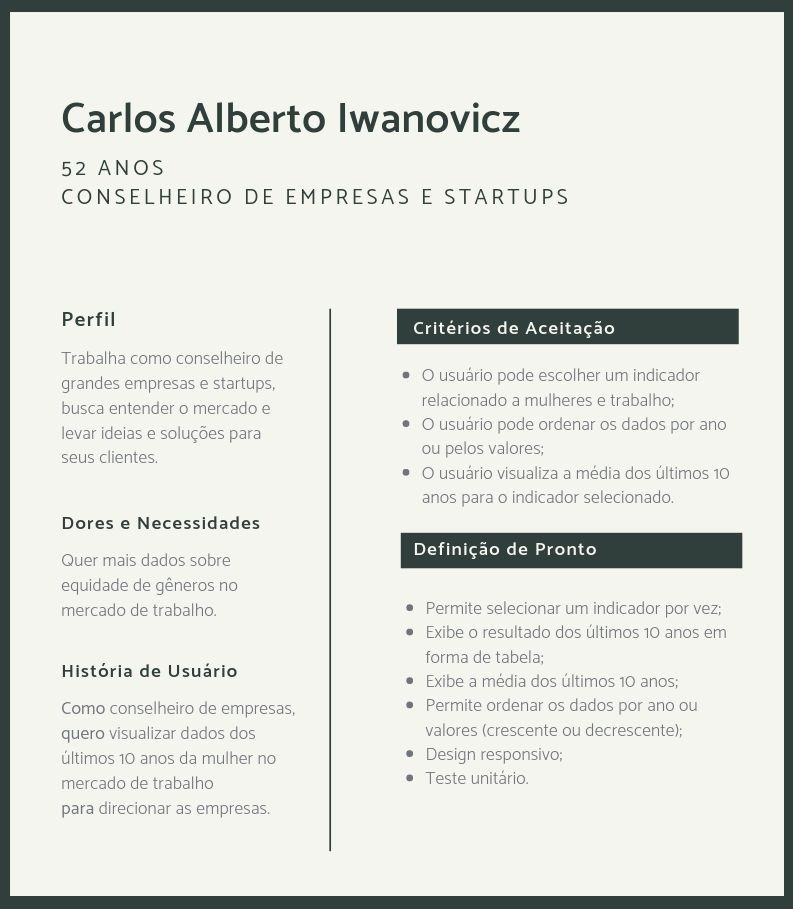
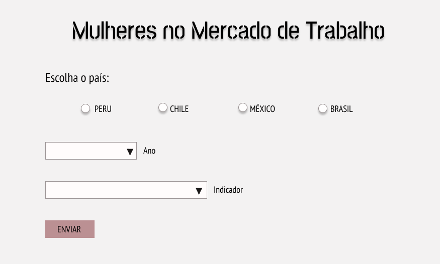
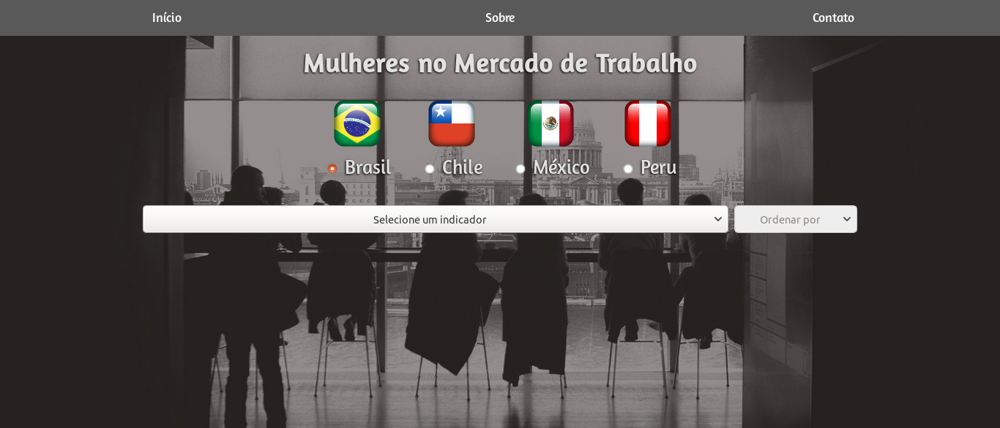
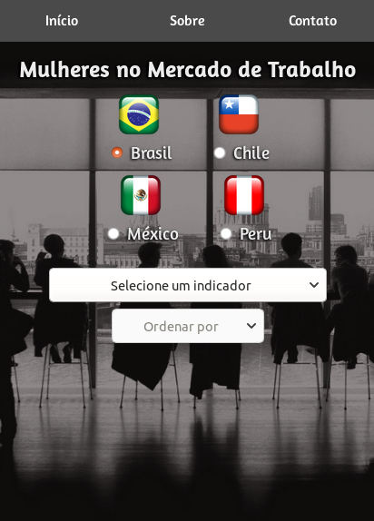

# Data Lovers

## 1. Resumo do Projeto

O presente projeto foi realizado em duplas e é parte do bootcamp da Laboratoria, onde o objetivo foi construir uma página web, manipulando dados e, então, apresentar ao usuário o que ele busca.

Escolhemos trabalhar com o banco de dados do Banco Mundial, conforme link abaixo:
* [Indicadores de desenvolvimento do Banco Mundial](src/data/worldbank/worldbank.json) de alguns países (Brasil, Chile, México e Perú). Estes dados incluem indicadores demográficos, econômicos e comerciais.

Além disso, também elaboramos os testes unitários de cada função implementada.

## 2. Desenvolvimento do Projeto

Escolhemos um assunto dentre todos os indicadores disponíveis no banco de dados. A questão da equidade de gêneros no mercado de trabalho é um tema que vem crescendo, portanto, decidimos focar nos indicadores que tivessem tal relação.

A página possibilita a visualização de indicadores relacionados a trabalho e que incluam mulheres, entre os anos de 2006 e 2017. O intuito é que esses dados estejam disponiveis de forma mais simples para uma pesquisa rápida. 

O projeto foi feito em HTML, CSS e Vanilla JS.

A visualização de dados em forma de gráficos é parte da hacker edition e utilizamos [Google Charts](https://developers.google.com/chart/).

### Arquivos
* `src/index.html` entra a página que vai ser exibida ao usuário.
* `src/main.js` contém os códigos relacionados a exibição dos dados na tela (interação com o DOM.
* `src/data.js` contém a manipulação de dados através de arrays e objetos.
* `src/style.css` estilização da página.
* `test/data.spec.js` contém os teste unitários das funções implementadas no arquivo `data.js`.

### Histórias de Usuário
Foram criadas duas personas com histórias de usuário e definição de pronto.

.

.

### Protótipo de baixa fidelidade

O primeiro protótipo de baixa fidelidade foi feito no papel, com uma visão geral e básica do que pensamos.

.

***

Após o primeiro sprint, redesenhamos e melhoramos.

.

### Layout da Página

Desktop
.

Celular
.